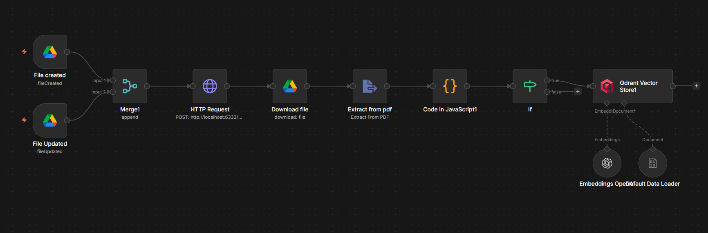
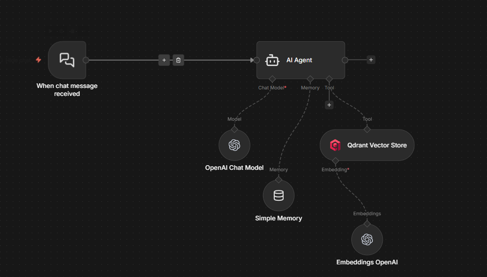
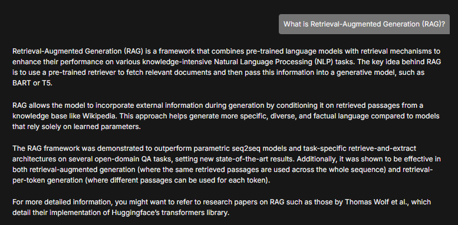
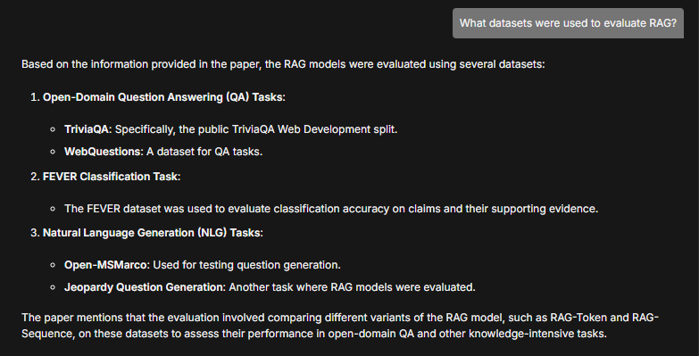
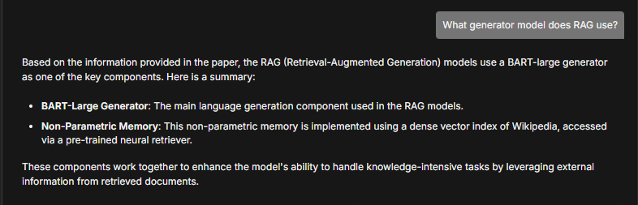
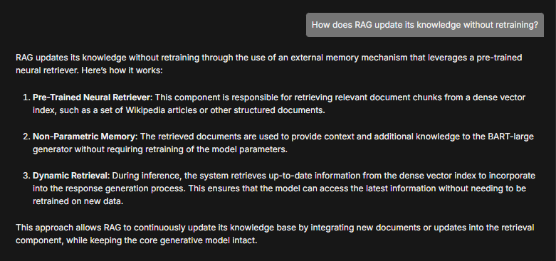
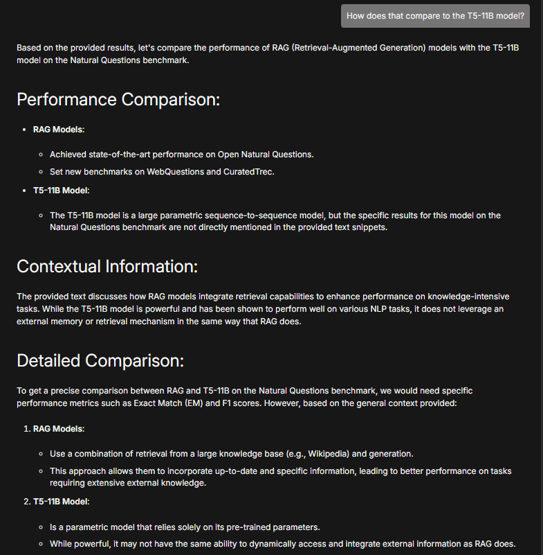
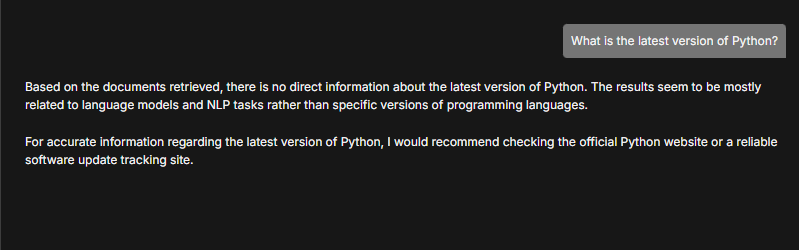

# 📄 PDF RAG Agent — n8n + Qdrant + LLM

A fully automated Retrieval-Augmented Generation (RAG) pipeline built with n8n that lets you chat with any PDF stored in Google Drive. Upload a PDF, ask questions, get answers grounded in your documents.

---

## 🏗️ Architecture

```
Google Drive Folder
        ↓
  n8n Ingestion Pipeline
  ├── Delete old vectors (deduplication)
  ├── Download file
  ├── Extract PDF text
  ├── Chunk text (1500 chars, 200 overlap)
  └── Embed + store in Qdrant

  n8n Query Pipeline
  ├── Chat trigger
  ├── AI Agent (qwen2.5-7b-instruct)
  ├── Qdrant vector search (top 15 chunks)
  └── Answer grounded in retrieved context
```

---

## 📸 Screenshots

### Ingestion Pipeline


### Query Pipeline


### Demo — Chatting with the RAG paper











### Hallucination Guard — Out of scope questions are handled gracefully


---

## ✨ Features

- **Automatic ingestion** — drop a PDF into a Google Drive folder and it's indexed within a minute
- **Deduplication** — updating a file re-indexes it cleanly without leaving stale vectors
- **Conversational memory** — the agent remembers context across messages in the same session
- **Grounded answers** — the agent is forbidden from answering without first querying the vector store
- **Hallucination guard** — if the answer isn't in the document, the agent says so instead of making something up
- **Local vector DB** — Qdrant runs locally via Docker, no cloud vector DB costs

---

## 🧰 Tech Stack

| Component | Tool |
|---|---|
| Workflow automation | [n8n](https://n8n.io) |
| Vector database | [Qdrant](https://qdrant.tech) |
| Embeddings | `text-embedding-nomic-embed-text-v1.5` (via OpenAI-compatible API) |
| LLM | `qwen2.5-7b-instruct` (via OpenAI-compatible API) |
| Document storage | Google Drive |
| PDF extraction | n8n Extract from File node |

---

## 📋 Prerequisites

- [n8n](https://docs.n8n.io/hosting/) — desktop app or self-hosted
- [Docker Desktop](https://www.docker.com/products/docker-desktop/) — to run Qdrant
- Google Drive account with OAuth2 credentials configured in n8n
- OpenAI-compatible API endpoint (for embeddings and LLM)

---

## 🚀 Setup

### 1. Start Qdrant

```bash
docker run -p 6333:6333 qdrant/qdrant
```

Verify it's running by opening `http://localhost:6333/dashboard` in your browser.

### 2. Import workflows into n8n

1. Open n8n
2. Go to **Workflows → Import**
3. Import `RAG_ingestion_pipeline.json`
4. Import `RAG_query.json`

### 3. Configure credentials

In n8n, set up the following credentials:

| Credential | Used by |
|---|---|
| Google Drive OAuth2 | Ingestion pipeline triggers + file download |
| Qdrant API | Both pipelines (host: `http://localhost:6333`) |
| OpenAI-compatible API | Embeddings + LLM (point to your endpoint) |

### 4. Configure the ingestion pipeline

1. Open `RAG_ingestion_pipeline`
2. In the **File created** and **File Updated** trigger nodes, select your target Google Drive folder
3. Activate the workflow

### 5. Configure the query pipeline

1. Open `RAG query`
2. Confirm all credentials are connected
3. Activate the workflow

### 6. Test it

1. Upload a PDF to your Google Drive folder
2. Wait ~1 minute for ingestion to trigger
3. Open the n8n chat interface for the RAG query workflow
4. Ask a question about your document

---

## 📁 Repository Structure

```
├── RAG_ingestion_pipeline.json   # n8n ingestion workflow
├── RAG_query.json                # n8n query workflow
├── RAG_doc.pdf                   # Sample test document (original RAG paper)
├── README.md
└── screenshots/                  # Demo screenshots
    ├── pipeline_ingestion.png
    ├── pipeline_query.png
    ├── chat_1_what_is_rag.png
    ├── chat_2_datasets.png
    ├── chat_3_generator.png
    ├── chat_4_knowledge_update.png
    ├── chat_5_t5_comparison.png
    └── chat_hallucination_guard.png
```

---

## ⚙️ Configuration

You can tweak these values in the workflows:

| Parameter | Location | Default | Notes |
|---|---|---|---|
| Chunk size | Ingestion → Code node | 1500 chars | Larger = more context per chunk |
| Chunk overlap | Ingestion → Code node | 200 chars | Helps preserve context at boundaries |
| Top K results | Query → Qdrant node | 15 | Reduce to 6–8 for faster responses |
| Poll frequency | Ingestion → Drive triggers | Every minute | Increase for lower API usage |

---

## ⚠️ Known Limitations

- PDF files only — other file types (DOCX, images) are not currently supported
- Chunking is character-based, not paragraph-aware — may split sentences mid-way
- `indexed_vectors_count` stays 0 until points exceed the indexing threshold (10,000) — this is normal Qdrant behavior and doesn't affect search
- No source citation in responses — the agent answers from context but doesn't reference specific page numbers
- Small LLMs (7B) may confuse closely related concepts even when the correct context is retrieved

---

## 🗺️ Roadmap

- [ ] Google Docs/Sheets ingestion via Drive export API
- [ ] Paragraph-aware chunking
- [ ] Page number metadata for citations
- [ ] Score threshold filtering to reject low-confidence results
- [ ] Multi-language support via translation node

---
